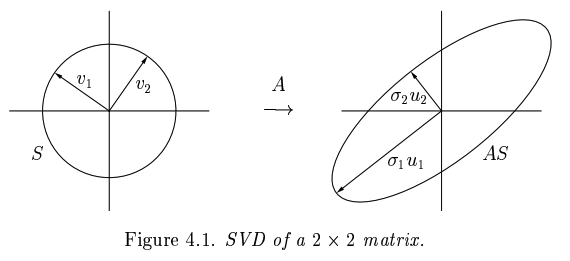
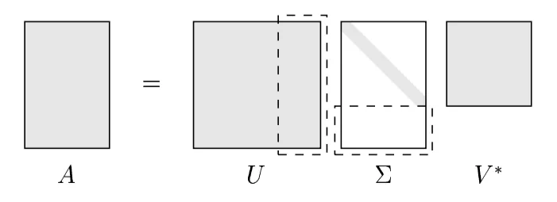

# SVD

Knowledge (and images) from *Numerical Linear Algebra* by Trefethen and Bau <3.

## Intuition

A geometric fact:

> The image of the unit sphere under any matrix $A \in \mathbb{R^{m \times n}}$ is a hyperellipse.
> 

What’s a hyperellipse?

- An $m$-dimensional ellipse.
    - Take the unit sphere in $\mathbb{R^m}$
    - Stretch by factors $\sigma_1, \dots, \sigma_m$ in unit vector directions $u_1, \dots, u_m \in \mathbb{R^m}$
- $\{\sigma_iu_i\}$: principal semiaxes of the hyperellipse with length $\sigma_1, \dots, \sigma_m$ (singular values!)
    
    
    

- **Left singular vectors:** unit vectors $\{u_1, u_2, \dots, u_n\}$ in the *directions* of the principal semiaxes of $AS$ (right-side picture)
    - (called "left" since $U$ is on the left in $U\Sigma V^T$)
- **Right singular vectors:** unit vectors $\{v_1, v_2, \dots, v_n\} \in S$ that are the pre-images of the principal semiaxes of $AS$, i.e. $Av_j = \sigma_ju_j$ (left-side picture)
    - (called "right" since $V$ is on the right in $U \Sigma V^T$)
## Full SVD

Let $A: m \times n$, $\text{rank}(A) = r$.

$\\ U \in m \times m$ 

- First $r$ columns: orthonormal basis for the column space of $A$, a.k.a. $\text{range}(A) \in \mathbb{R^m}$
    - **Left singular vectors** from above
- $m-r$ columns: orthonormal basis for the left null space of $A$, a.k.a $\text{ker}(A^T) \in \mathbb{R^m}$
    - Basis for space of vectors $y$ s.t. $A^Ty = 0$
- $U$ is unitary, i.e. $U^TU = UU^T = I$

$\Sigma: m \times n$

- Diagonal is the singular values (square root of eigenvalues) of $A^TA$ or $AA^T$
    - Non-negative, increasing order
    - Stretches the sphere into a hyperellipse
- $r$ positive singular values, $n-r$ zero singular values
- Padded with rows/columns of zeroes to be of shape $m \times n$

$V: n \times n$

- First $r$ columns: orthonormal basis for the row space of $A$, a.k.a. $\text{range}(A^T) \in \mathbb{R^n}$
    - **Right singular vectors** from above
- $n - r$ columns: orthonormal basis for the (right) null space of $A$, a.k.a. $\text{ker}(A) \in \mathbb{R^n}$
    - Basis for space of vectors $x$ s.t. $Ax = 0$
- $V$ is unitary, i.e. $V^TV = VV^T = I$

Apply $A$ to the unit sphere: $AS = U\Sigma V^T S$

- $V^T$: unitary map (preserves inner product), preserves the sphere
- $\Sigma$: stretches sphere into hyperellipse
- $U$: unitary map (preserves inner product), rotates/reflects hyperellipse

## Reduced SVD

Let $A: m \times n$, $\text{rank}(A) = r$.

**Idea:** get rid of superfluous columns/rows.

- $U: m \times r$
    - Remove $m - r$ columns that span the left nullspace of $A$
- $\Sigma: r \times r$
    - Remove padded rows/columns of zeroes
    - Strictly positive singular values on the diagonal
- $V: n \times r$
    - Remove $n - r$ columns that span the nullspace of $A$

## Low Rank Approximation

What *is* the SVD?

**Theorem.** $A$ is the sum of rank-one matrices:

$$
A = \sum_{j=1}^r \sigma_j u_j v_j^T
$$

**Proof:** Clear - write $\Sigma$ as the sum of $\Sigma_1, \dots, \Sigma_r$, where $\Sigma_j = \text{diag}(0,\dots, 0, \sigma_j, 0, \dots, 0)$.

There is a special property here…

**Eckart-Young-Mirsky Theorem.**

The SVD discovers the best low-rank approximation of $A$!

Say we take the $k^{th}$ partial sum $A_k$, where $k < r$.

**Theorem:**

For the Frobenius norm:

$$
||A - A_k||_F = \min_{\text{rank}(B) \le k} ||A - B||_F = \sqrt{\sigma_{k+1}^2 + \sigma_{k+2}^2 + \cdots + \sigma_r^2}
$$

For the 2-norm:

$$
||A - A_k||_2 = \min_{\text{rank}(B) \le k} ||A - B||_2 = \sigma_{k+1}
$$

- The $k^{th}$ partial sum captures as much of the **energy of $A$** as possible.
    - …where energy is the 2-norm or Frobenius norm.

**Interpretation**

- What is the best approximation of a hyperellipsoid by a line segment?
    - The longest axis.
- What is the best approximation of a hyperellipsoid by a 2-d ellipse?
    - The ellipse spanning the longest and second-longest axis.
- etc…

Each approximation accounts for the *next largest axis* of the hyperellipsoid *not yet included*.

After $r$ steps, we have captured all of $A$!

# PCA

**Given** points $x_1, \dots x_n \in \mathbb{R^m}$

**Goal:** find a $k$-dimensional subspace $S$ (where $k << m$) that is close to these points.

**Def. $P_s :=$** orthogonal projection onto $S$.

$$
S^* = \min_S \frac{1}{n}\sum_{i=1}^n ||x_i - P_s x_i ||^2
$$

**Solution:** $S = \{u_1, \dots, u_k \}$, the left singular vectors of $X \in \mathbb{R^{m \times n}}$.

Moreover, the approximation error is the sum of squares of the “neglected” singular values:

$$
\sum_{i=1}^n ||x_i - P_s x_i||^2 = \sum_{e = k+1} \sigma_e^2
$$

### PCA Algorithm

1. Center the data (subtract mean).
    
    Empirical mean: $\mu = \frac{1}{n} \sum_{i=1}^n x_i \in \mathbb{R^m}$
    
    $\implies \bar{x}_i = x_i = \mu$
    
2. Compute SVD of $\left[\bar{x}_1 | \dots | \bar{x}_n\right]$.
    
    $\implies \bar{U}\bar{\Sigma}\bar{V}^T$
    
3. Get the $k$-dimensional PCA projection: $\bar{U}_k^T \bar{x}_i \in \mathbb{R}^k$.

Based on Eckart-Young-Mirsky theorem, this is the best low-rank subspace!

### Intuition

PCA can be interpreted as fitting a $k$-dimensional hyperellipsoid to the data.

- Each axis of the ellipsoid represents a principal component.

Why do we need to center the data?

- This is equivalent to moving the hyperellipsoid to the origin.
- If we don’t, the first singular vector will influence the mean:
    - $u_1 \approx \mu$. Why? because $\mu$ minimizes $\frac{1}{n}\sum_{i=1}^n ||x_i - \mu||^2$
- We want to choose vectors orthogonal to zero, not restricted to be orthogonal to $u_1$.

# Computing the SVD

How do we actually compute the (full) SVD?

**Idea:** turn it into an eigenvalue decomposition problem (power iterations!).

### **Eigendecomposition**

Vector $v$ is an eigenvector of $A$ if $Av = \lambda v$ for some scalar $\lambda$ (the eigenvalue). 

For a square matrix $A: n \times n$ with $n$ linearly independent eigenvectors $q_i$:

$$
A = Q \Lambda Q^{-1}
$$

- $Q: n \times n$, matrix whose $i^{th}$ column is the eigenvector $q_i$ of $A$
    - The (non-zero) $q_i$ form a basis for the range of $A$
    - The zero $q_i$ form a basis for the nullspace of $A$
- $\Lambda: n \times n$, diagonal matrix of eigenvalues $\lambda_i, \dots, \lambda_n$

How to find the principal eigenvalue and eigenvector of a symmetric matrix $M$?

**Algorithm:**

1. Start with “guess eigenvector” $x_0$
2. Construct
    
    $$
    x_{k+1} = \frac{M_{x_k}}{||M_{x_k}||_F}
    $$
    
    for $k = 0, 1, \dots$
    
3. Stop when consecutive $x_k$’s don’t change very much (convergence).
4. Resulting $x$: first principal eigenvector. 
5. Find the eigenvalue for $x$, $\lambda = x^TMx$.
    
    (Why? Because $x\lambda = Mx$).
    
6. Eliminate portion of matrix $M$ corresponding to first eigenpair:
    
    $M^*:= M - \lambda xx^T$, here $xx^T$ is the rank-one matrix corresponding to first PE
    
7. Repeat process on $M^*$ to find second PE (principal eigenpair)

### Iterative Eigenpairs for the SVD

Given $A: m \times n$, consider the square and symmetric matrices $AA^T$ and $A^TA$.

- $AA^T: m\times m, = U\Sigma V^TV\Sigma U^T = U\Sigma^2U^T$
    - $\implies AA^TU = U\Sigma^2$
    - Therefore the $i^{th}$ column of $U$ is an eigenvector of $AA^T$ with eigenvalue $\Sigma_{ii}^2$
- $A^TA: n \times n, = V \Sigma U^TU\Sigma V^T = V\Sigma^2V^T$
    - $\implies A^TAV = V\Sigma^2$
    - Therefore the $i^{th}$ column of $V$ is an eigenvector of $A^TA$ with eigenvalue $\Sigma_{ii}^2$

Iteratively compute eigenpairs of $A^TA$ to get $U$.

Iteratively compute eigenpairs of $AA^T$ to get $V$.

Take square root of eigenvalues from above to get $\Sigma$.

**This gives us the SVD!**

- Time complexity: $\min\left[O(nm^2), O(n^2m\right]$

### Drawbacks of the SVD

Interpretability problem:

- Singular vector is a linear combination of all input columns/rows
- How do we interpret that?

Lack of sparsity:

- Singular vectors are dense! (Storage :thumbsdown:).